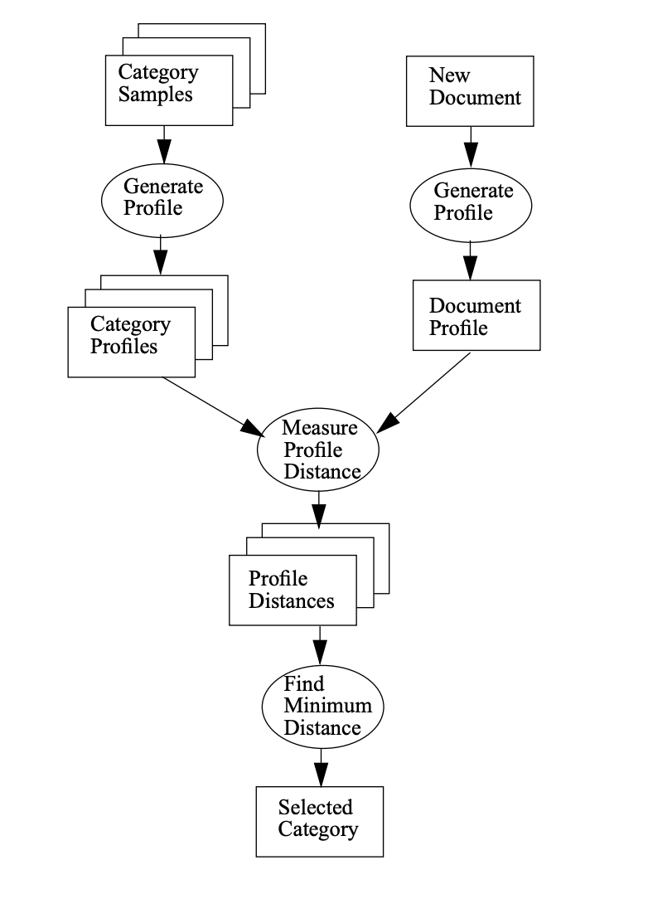

# Language Detector


## About

This project is a language detector based on the [N-Gram-Based Text Categorization algorithm](https://dsacl3-2019.github.io/materials/CavnarTrenkle.pdf).. It can detect the language of a given text string.




## Installation

To install this package, run the following command:

```sh
go get -u github.com/gobylor/langdetect
```


## Usage

### simple case

```go
func main() {
	text := "An n-gram is a sequence of n adjacent symbols in particular order." +
		"The symbols may be n adjacent letters (including punctuation ma" +
		"rks and blanks), syllables, or rarely whole words found in a language dataset"
	detect := langdetect.Detect(text)
	log.Printf("Detected language: %s\n", detect.Lang)
}

```


### Detect With Options

```go
func main() {
	text := "An n-gram is a sequence of n adjacent symbols in particular order." +
		"The symbols may be n adjacent letters (including punctuation ma" +
		"rks and blanks), syllables, or rarely whole words found in a language dataset"

	options := []langdetect.Option{
		langdetect.WithWhitelist(langdetect.Eng),
	}
    detect := langdetect.Detect(text, options...)
	log.Printf("Detected language: %s\n", detect.Lang)

	options = []langdetect.Option{
		langdetect.WithBlacklist(langdetect.Eng),
	}
	detect = langdetect.Detect(text, options...)
	log.Printf("Detected language: %s\n", detect.Lang)
	

	options = []langdetect.Option{
		langdetect.WithReliableConfidenceThreshold(0.25),
	}
	detect = langdetect.Detect(text, options...)
	log.Printf("Detected language: %s\n", detect.Lang)
}

```


## LICENSE

This project is licensed under the terms of the Apache 2.0 License 


